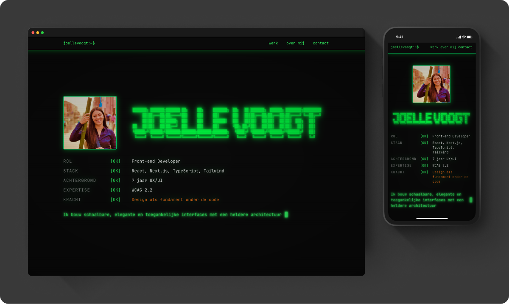

# Portfolio v8.2 — Joelle Voogt

Dit is mijn persoonlijke portfolio. De site is opgezet als een terminal-thema: een "boot sequence" met systeeminfo, secties die aanvoelen als terminalvensters, en groene glow-accenten op een donkere achtergrond. Het laat zien wie ik ben, waar ik aan gewerkt heb, en hoe iemand contact met me kan opnemen.

Live: [joellevoogt.vercel.app](https://joellevoogt.vercel.app)



### Secties

- **hero** — intro met avatar, ASCII-naam en een "system boot" met
  rol, stack, achtergrond en expertise
- **whoami** (`~/about`) — wie ik ben en welke technologieën ik
  gebruik
- **projects** (`~/werk`) — uitgelicht werk, elk project in een
  eigen "venster"
- **contact** — e-mail, LinkedIn en GitHub

## Hoe is het opgezet?

**Stack**

- Next.js 16 (App Router)
- React 19
- TypeScript
- Tailwind v4

**Design system**

Volledig opgebouwd in `app/globals.css` met Tailwind v4 `@theme`
blokken — er is geen `tailwind.config` bestand.

- Kleurenschalen: `brand` (groen, 50–950), `secondary` (oranje,
  50–950), `surface` (neutraal, 0–950)
- Shadow-tokens: `--shadow-brand`, `--shadow-secondary`,
  `--shadow-brand-card`
- Custom utilities: `text-glow-brand` / `text-glow-secondary`
  (tekst-glow), `project-image` (hover box-shadow),
  `link-button` (inset fill-animatie)
- Typografie: Poppins (body), JetBrains Mono (mono), Geist Sans (UI)

**Architectuur**

- `app/` — Next.js routes en globale stijlen
- `sections/` — de pagina-secties (`hero`, `whoami`, `projects`,
  `contact`, `nav`, `footer`)
- `components/` — herbruikbare bouwstenen: `Button`, `ProjectCard`,
  `ProjectWindow`, `Tag`, `TagList`, `Skill`, `Socials`,
  `SystemBoot`, `Terminal`, `Directories`, `Concatenate`
- `data/projects.tsx` — projectdata los van de presentatie, zodat
  content en layout gescheiden blijven

## Zelf runnen

```bash
npm install
npm run dev
```

Open [http://localhost:3000](http://localhost:3000).

Overige scripts:

```bash
npm run build   # productie-build
npm run start   # productie-build lokaal serveren
npm run lint    # eslint
```
